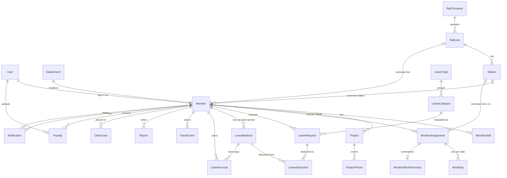

# kumo HR — Data Model

> Entity-relationship view of the Django models defined field by field in `PROJECT_STRUCTURE.md` §3.
> Rules that act on these models are in `BUSINESS_RULES.md`.
> Every model also has `id`, `created_at` and `updated_at` (`TimeStampedModel`); they are left out of the diagram.

---

## 1. Overview

`Holiday`, `MailLog` and `ErrorLog` have no relationships. `ErrorLog` and `MailLog` deliberately have no foreign keys, so their rows survive member deletion.

---

## 2. Models by app

| App | Model | Key fields | Uniqueness |
|---|---|---|---|
| accounts | `User` | `email`, groups, `must_change_password`, `failed_login_count`, `locked_until` | `email` |
| core | `ErrorLog` | `occurred_at`, `user_id` (no FK), `source`, `error_class`, `message`, `traceback` | — |
| people | `Department` | `code`, `name` | `code` |
| people | `Member` | `user`, `employee_no`, `name`, `name_kana`, `department`, `employment_type`, `weekly_work_days`, `weekly_work_hours`, language levels, commute, `deleted_at` | `user`, `employee_no` |
| people | `MemberSkill` | `member`, `category`, `name`, `acquired_year` | — |
| people | `Project` | `member`, `start_date`, `end_date`, `client_company`, `role`, `team_size` | — |
| people | `ProjectPhase` | `project`, `phase` | `(project, phase)` |
| transit | `RailCompany` / `RailLine` / `Station` | `code` PK, `name`, `is_active`, `sort` | `code` |
| calendar_master | `Holiday` | `date` PK, `name` | `date` |
| timesheets | `MonthlyAssignment` | `member`, `month`, `work_site`, commute, `pass_price`, `status`, approval fields | `(member, month)` |
| timesheets | `WorkDay` | `assignment`, `date`, times, `break_minutes`, hour fields, `work_content` | `(assignment, date)` |
| leave | `LeaveType` | `code`, `name` | `code` |
| leave | `LeaveCategory` | `code`, `leave_type`, `day_count`, `is_hourly`, `deducts_from`, `counter` | `code` |
| leave | `LeaveRequest` | `member`, `category`, dates, times, `status`, `decided_by`, `cancelled_at` | — |
| leave | `LeaveBalance` | `member`, `period_start`, `expires_on`, `granted_days`, day totals, `hourly_used_hours`, counters, `is_active` | `(member, period_start)` |
| leave | `LeaveDeduction` | `request`, `balance`, `days` | — |
| leave | `LeaveAccrual` | `member`, `month`, `rule_code`, `days`, `balance` | `(member, month, rule_code)` |
| travel | `TravelClaim` | `member`, `used_on`, `category`, `transport_method`, `amount`, `attachment`, statuses | — |
| reports | `Report` | `author`, `report_type`, `period_start`, `period_end`, `contents` | — |
| reports | `MonthlyWorkSummary` | `assignment`, `status_summary`, `issues`, `response` | `assignment` |
| reports | `ClientCase` | `member`, `month`, `case_name`, `customer` | `(member, month)` |
| payroll | `Payslip` | `member`, `period`, `pdf`, `uploaded_by`, `viewed_at`, `deleted_at` | `(member, period)` |
| notifications | `Notification` | `recipient`, `sender`, `title`, `body`, `read_at` | — |
| notifications | `MailLog` | addresses, `subject`, `body`, `sent_at`, `result` | — |

---

## 3. Conventions

- **One member reference.** Every employee-scoped table has a foreign key to `Member`. `employee_no` is for display and payslip file matching only, never a join key.
- **Month columns** are a `DateField` holding the 1st of the month (`month`, `period`).
- **Hours** are `Decimal(5, 2)`. **Money** is an integer in yen. **Dates and times** use `DateField` / `TimeField`, never text.
- **Enums** are `IntegerChoices` or `TextChoices`, each with a database `CheckConstraint`. Each domain has its own enum.
- **Soft delete** for `Member` and `Payslip` (`deleted_at`); the default manager hides deleted rows. Nothing is hard-deleted, so records survive the statutory retention period (`BUSINESS_RULES.md` §6.5).
- **Employment type is descriptive.** Leave grants are decided by `weekly_work_days` and `weekly_work_hours`, not by `employment_type` (`BUSINESS_RULES.md` §4.1).
- **History.** `django-simple-history` tracks `Member`, `LeaveRequest`, `MonthlyAssignment`, `TravelClaim` and `Payslip`.
- **Leave is linked to the member, not to the monthly assignment** (ADR 0004), so a request can span two months.
- **One `LeaveBalance` per grant.** Grants overlap: the previous one stays usable until `expires_on`, and `LeaveDeduction` records which grant paid for each request (`BUSINESS_RULES.md` §4.1a).
